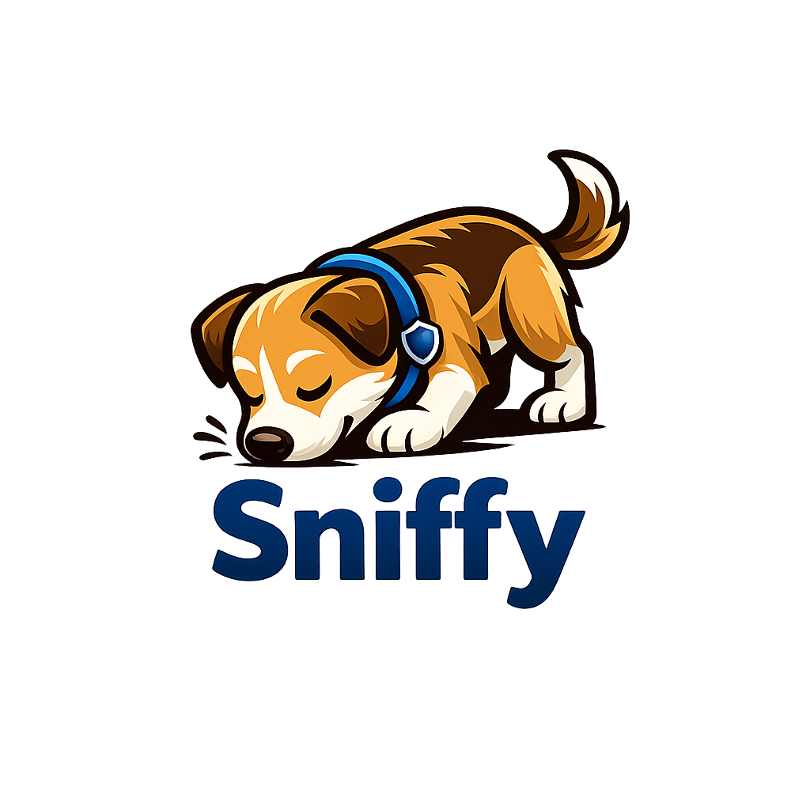

# Sniffy

<p align="center">
  
</p>

<p align="center">
  <strong>Automated credential leak detection for public repositories</strong>
</p>

---

## What is Sniffy?

Sniffy is an open-source security tool that continuously scans public GitHub repositories to detect accidentally leaked credentials, API keys, tokens, and other secrets. When a potential leak is found, Sniffy immediately notifies the configured recipients so the exposed credentials can be rotated before they are exploited.

> **Sniffy is built for good.**
>
> This application is designed to help developers and security teams protect their projects by raising awareness of accidental leaks. It is **not** a tool for exploiting discovered secrets, and it should **never** be used to profit from, abuse, or otherwise take advantage of exposed credentials. If you find a leak, please act responsibly: notify the repository owner or rotate your own credentials promptly.

### Detection strategies

Sniffy uses multiple complementary detection strategies to minimize false negatives:

- **Regex patterns** — Matches known secret formats (AWS keys, GitHub tokens, Slack tokens, JWTs, private keys, etc.)
- **Entropy analysis** — Identifies high-entropy strings that look like randomly generated secrets
- **Git history scanning** — Scans commit diffs and reflog to find secrets that were added and later "removed" from the worktree

### Dual-track scanning

Sniffy runs two parallel scanning tracks:

- **Fresh track** — Discovers brand-new public repositories as they are created on GitHub
- **Active track** — Re-scans recently updated repositories within a configurable time window

This ensures both broad coverage and timely detection of leaks introduced in existing projects.

---

## Setup and run

### Prerequisites

- [Go](https://go.dev/dl/) 1.22 or later
- [Git](https://git-scm.com/)
- A GitHub Personal Access Token (optional but strongly recommended)

### 1. Clone the repository

```bash
git clone https://github.com/lucasmacori/sniffy.git
cd sniffy
```

### 2. Configure your environment

Copy the example environment file and fill in your values:

```bash
cp .env.example .env
```

Edit `.env` with your settings (see the [Configuration](#configuration) section below for all available options).

At minimum you should set:

- `GITHUB_TOKEN` — Required for reasonable rate limits (30 req/min vs 10 req/min)
- `SMTP_HOST`, `SMTP_FROM`, `SMTP_TO` — Required if you want email notifications

### 3. Build

```bash
go build -o sniffy .
```

### 4. Run

```bash
./sniffy
```

The application automatically loads variables from `.env` at startup.

### Running with Docker (optional)

```bash
docker build -t sniffy .
docker run --env-file .env -v $(pwd)/data:/app/data sniffy
```

---

## Configuration

All configuration is done through environment variables. You can place them in a `.env` file in the project root; Sniffy loads it automatically on startup.

### GitHub

| Variable | Default | Description |
|----------|---------|-------------|
| `GITHUB_TOKEN` | *(empty)* | GitHub Personal Access Token (classic or fine-grained). Provides higher rate limits and authenticated API access. If invalid or expired, the worker automatically falls back to unauthenticated mode. |

### Worker

| Variable | Default | Description |
|----------|---------|-------------|
| `WORKER_ID` | *(auto-generated)* | Unique identifier for this worker instance. Auto-generated from hostname + random suffix if not set. |

### Database

| Variable | Default | Description |
|----------|---------|-------------|
| `DATABASE_PATH` | `./data/sniffy.db` | Path to the SQLite database file used for persisting findings, statistics, and scan checkpoints. |

### Scanning

| Variable | Default | Description |
|----------|---------|-------------|
| `CONFIDENCE_THRESHOLD` | `25` | Minimum confidence score (0–100) for a finding to be reported. |
| `MAX_CONCURRENT_CLONES` | `10` | Maximum number of repositories cloned simultaneously. |
| `MAX_REPO_SIZE_GB` | `1` | Repositories larger than this size (in GB) are skipped. |
| `DISK_LIMIT_GB` | `10` | Maximum total disk space (in GB) that all active clones may consume at once. |
| `ACTIVE_SCAN_WINDOW_HOURS` | `1` | How far back the Active track looks for recently updated repositories. |
| `FRESH_TRACK_SLEEP_SECONDS` | `30` | How long the Fresh track sleeps when no new repositories are found before checking again. |

### Notifications

| Variable | Default | Description |
|----------|---------|-------------|
| `NOTIFIER_TYPES` | `email` | Comma-separated list of notifier types to enable. Currently only `email` is supported. |
| `NOTIFICATION_RATE_LIMIT` | `10` | Maximum number of notifications per second. |

### Email notifier

| Variable | Default | Description |
|----------|---------|-------------|
| `EMAIL_CONFIDENCE_THRESHOLD` | `25` | Minimum confidence score required to trigger an email notification. |
| `SMTP_HOST` | *(empty)* | SMTP server hostname (e.g. `smtp.gmail.com`). Required for email notifications. |
| `SMTP_PORT` | `587` | SMTP server port. |
| `SMTP_USERNAME` | *(empty)* | SMTP authentication username. |
| `SMTP_PASSWORD` | *(empty)* | SMTP authentication password or app-specific password. |
| `SMTP_FROM` | *(empty)* | Sender email address. |
| `SMTP_TO` | *(empty)* | Recipient email address(es). Multiple addresses can be separated by commas. |

---

## Other information

### Architecture

```
┌─────────────┐     ┌─────────────┐     ┌─────────────┐
│  Fresh Track│     │ Active Track│     │  Rate Limiter│
│  (new repos)│     │(updated repos)    │  (token bucket)
└──────┬──────┘     └──────┬──────┘     └─────────────┘
       │                   │
       └─────────┬─────────┘
                 ▼
          ┌─────────────┐
          │ GitHub API  │
          └──────┬──────┘
                 ▼
          ┌─────────────┐
          │ Git Cloner  │
          └──────┬──────┘
                 ▼
          ┌─────────────┐
          │  Detectors  │  ← Regex + Entropy + Git History
          └──────┬──────┘
                 ▼
          ┌─────────────┐
          │  Storage    │  ← SQLite (findings, stats, checkpoints)
          └──────┬──────┘
                 ▼
          ┌─────────────┐
          │  Notifiers  │  ← Email (extensible)
          └─────────────┘
```

### Development

Run tests:

```bash
go test ./...
```

Run tests with coverage:

```bash
go test -cover ./...
```

### Database schema

Sniffy uses SQLite with three main tables:

- **`findings`** — Stores every detected potential secret with metadata (repository, file, line, confidence, etc.)
- **`statistics`** — Aggregated scan metrics per worker per cycle
- **`scan_checkpoints`** — Tracks the last scanned position for each track (Fresh / Active) to resume without duplication

### Ethical use

- Only scan **public** repositories.
- Do not use discovered credentials for unauthorized access.
- Notify repository owners when you find leaks in their projects.
- Consider responsible disclosure practices.

### License

This project is open source. See the repository for license details.

### Contributing

Contributions are welcome! If you find a bug, have a feature request, or want to add a new detector or notifier, feel free to open an issue or pull request.
